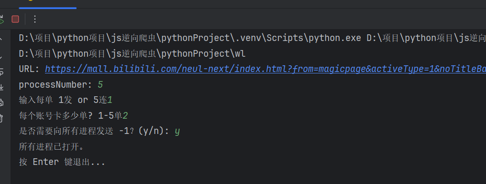

# ok



```java
class a{
    int  a;
    int b;
    void say(){
        System.out.println("hell world");
    }
}
```

```python
import request

data = {
    "username":"limin",
    "pws":"123"
}
url = "https://www.baidu.com"
header ={
    "user-agent":"MOki"
}
result = request.post(url=url,data=data,header=header)

print(result.json())
```

```javascript
const s = 9
function a (){
    consol.log("hello world");
}

```

```html
<button>
</button>
```

>ok

|a |b |c | d  |
|--|---|--|--- |
|d | c | |    |
|d | c | |    |
|d | c | |    |
|---|--| |    |

```java
class a{
    int a = 0;
    int b = 0;
}
```

分割线

-----

链接
<https:www.baidu.com>

引用
这是一个链接 [Markdown语法](https://markdown.com.cn)

加粗
**a**

斜体
*a*
